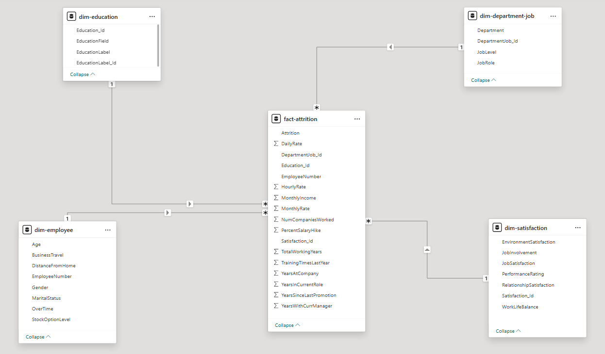

<!-- -*- coding: utf-8; -*- -->

# Projeto 01 IBM-HR 📊
Este repositório contém o projeto prático **Projeto 01 IBM-HR**, desenvolvido no âmbito do curso **AIDAPT-04** da **cegid Academy**. O objetivo principal do projeto é analisar dados de Recursos Humanos utilizando 'SQL', 'R' e 'Power BI' para gerar insights estratégicos.

O projeto será apresentado nos **dias 5 e 6 (primeira semana) de agosto de 2026** pelo **Grupo #2 _Power Squad_**.

---

## 👥 Elementos do Grupo
* Edgar Apolinário, mailto:edgarapolinario855@gmail.com 
* Nilton Ávido, mailto:capaia1986@gmail.com 
* Raquel Cunha, mailto:raquelmcunha@gmail.com 
* Tiago Rodrigues, mailto:tiag0rkayh@gmail.com 

## 👨‍🏫 Professor Orientador
* João Lauro de Marco, https://pt.linkedin.com/in/joao-lauro-de-marco/pt

---

## 📁 Organização do Repositório

Para manter o projeto limpo e colaborativo no Git, a estrutura de pastas foi organizada da seguinte forma:

* **`/dashboards`**: Contém os ficheiros de desenvolvimento e relatórios finais do Power BI (`.pbix` ou `.pbip`).
* **`/documentation`**: Centraliza os ficheiros de suporte do projeto, incluindo o relatório escrito em Word/PDF, a apresentação em PowerPoint e o levantamento de requisitos.
* **`/img`**: Armazena os recursos visuais do projeto, como logótipos, ícones e imagens de fundo (*backgrounds*) usadas no design das páginas do relatório.
* **`/source-data`**: Guarda os ficheiros originais em Excel que servem como fonte de dados (dados brutos/crus) para o Power BI.

---

## 🚀 Como Executar o Projeto

1. **Clonar o Repositório:**
   ```bash
   git clone https://github.com/annatagus/ibm.git
   ```
2. **Fontes de Dados:** As bases de dados em Excel encontram-se na pasta `/source-data`.
3. **Abrir o Relatório:** Garanta que tem o *Power BI Desktop* instalado e abra o ficheiro guardado na pasta `/dashboards`.
   * *Nota:* Caso as ligações de dados falhem ao abrir noutro computador, verifique a configuração dos caminhos das fontes no Power Query.

---

## 🛠️ Tecnologias Utilizadas
* **Microsoft Power BI** - Tratamento de dados (Power Query), modelagem e criação de dashboards.
* **Microsoft SQL Server** - Armazenamento e consulta à base de dados relacional.
* **R (Google Colab)** - Análise estatística e manipulação avançada de dados em ambiente cloud.
* **Microsoft Excel** - Armazenamento e consulta dos ficheiros de dados originais.
* **Microsoft Word / PowerPoint / PDF** - Criação de relatórios escritos e suporte para a apresentação.
* **Git & GitHub** - Controlo de versão e ambiente colaborativo para o grupo.

---

## 📐 Modelo de Dados (Star Schema)

Para garantir o máximo desempenho e eficiência no Power BI, o modelo foi estruturado seguindo um esquema em estrela (*Star Schema*), composto por uma tabela central de factos interligada a tabelas de dimensões.



> 📖 **Documentação Detalhada:** Para consultar os tipos de dados, transformações de colunas e o mapeamento completo de cada atributo deste modelo, aceda ao nosso [Dicionário de Dados](documentation/dicionario_dados.md).
