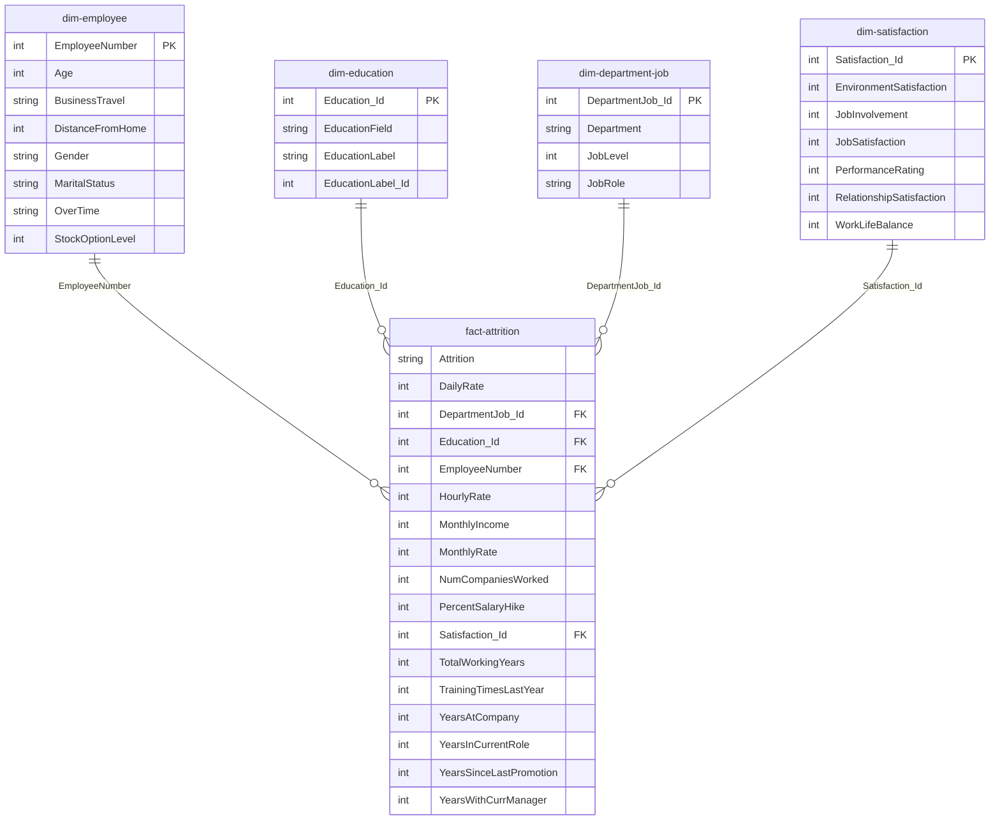

<!-- -*- coding: utf-8; -*- -->

# Dicionário de Dados - Projeto 01 IBM HR

Este documento fornece a descrição detalhada das variáveis do conhecido dataset **IBM HR Analytics Employee Attrition & Performance**. O projeto foi desenvolvido em **Power BI** para analisar e identificar os principais fatores que influenciam a rotação de colaboradores (atrito) na organização.

## 📊 Metadados do Projeto
* **Ferramenta Principal:** Microsoft Power BI
* **Idioma do Negócio:** Inglês (Nomes das colunas originais mantidos)
* **Idioma da Documentação:** Português (PT-PT)
* **Unidade de Distância:** Quilómetros (km) - *valores numéricos originais assumidos diretamente em km*
* **Arquitetura de Dados:** Star Schema (Esquema em Estrela)

---

## 📐 Arquitetura do Modelo (Star Schema)

O modelo de dados segue as melhores práticas de Business Intelligence, estruturado num **Esquema em Estrela (Star Schema)**. É composto por uma tabela central de factos e quatro tabelas de dimensões, interligadas por chaves sub-rogadas/identificadores (`_Id`):

### 1. Tabela de Factos
* **`fact-attrition`**: Tabela central contendo as métricas de negócio, valores financeiros, histórico temporal na empresa e as chaves estrangeiras que ligam às dimensões.

### 2. Tabelas de Dimensões
* **`dim-employee`**: Atributos demográficos, fixos e contratuais do colaborador (Ligada através de `EmployeeNumber`).
* **`dim-education`**: Detalhes sobre a formação e nível académico (Ligada através de `Education_Id`).
* **`dim-department-job`**: Estrutura organizacional e funções desempenhadas (Ligada através de `DepartmentJob_Id`).
* **`dim-satisfaction`**: Métricas de inquéritos internos e clima organizacional (Ligada através de `Satisfaction_Id`).

---

## 🗂️ Tabela de Atributos

| Nome da Coluna (Original) | Tipo de Dados (Power BI) | Localização no Modelo | Descrição em Português (PT-PT) | Notas / Transformações |
| :--- | :--- | :--- | :--- | :--- |
| **Age** | Inteiro | `dim-employee` | Idade do colaborador (18 a 60 anos). | Métrica demográfica base. |
| **Attrition** | Texto | `fact-attrition` | Se o colaborador deixou a empresa (Yes/No). | **Variável Alvo (Target)**. |
| **BusinessTravel** | Texto | `dim-employee` | Frequência de viagens em trabalho. | Categoria comportamental. |
| **DailyRate** | Inteiro | `fact-attrition` | Tarifa ou custo diário do colaborador. | Nível salarial/custo. |
| **Department** | Texto | `dim-department-job`| Departamento atual na empresa. | Estrutura organizacional. |
| **DepartmentJob_Id** | Inteiro / Chave | Ambas | ID interno gerado para ligar setor e cargo. | Chave de Ligação / Relacionamento. |
| **DistanceFromHome** | Inteiro | `dim-employee` | Distância entre residência e o trabalho (em **km**). | Valores originais assumidos em km. |
| **Education** | Inteiro | *N/A* | *Coluna Ignorada / Normalizada* | Substituída pelo ID na dimensão. |
| **Education_Id** | Inteiro / Chave | Ambas | ID de ligação para o nível de escolaridade. | Chave de Ligação / Relacionamento. |
| **EducationField** | Texto | `dim-education` | Área de formação académica do colaborador. | Atributo categórico. |
| **EducationLabel** | Texto | `dim-education` | Descrição textual do nível (Ex: Licenciatura). | Atributo textual auxiliar. |
| **EducationLabel_Id** | Inteiro | `dim-education` | ID de ordenação para as etiquetas de educação. | Usado para ordenar gráficos. |
| **EmployeeCount** | Inteiro | *N/A* | *Coluna Ignorada*. | **Ignorado:** Valor fixo 1 removido. |
| **EmployeeNumber** | Inteiro / Chave | Ambas | Identificador único do colaborador. | Chave de Ligação primária. |
| **EnvironmentSatisfaction** | Inteiro | `dim-satisfaction` | Grau de satisfação com o ambiente (1-4). | Métrica de clima organizacional. |
| **Gender** | Texto | `dim-employee` | Género do colaborador (Female/Male). | Dado demográfico. |
| **HourlyRate** | Inteiro | `fact-attrition` | Valor pago por hora ao colaborador. | Métrica financeira horária. |
| **JobInvolvement** | Inteiro | `dim-satisfaction` | Nível de envolvimento no trabalho (1-4). | Indicador comportamental. |
| **JobLevel** | Inteiro | `dim-department-job`| Nível hierárquico do cargo (1-5). | Senioridade organizacional. |
| **JobRole** | Texto | `dim-department-job`| Função ou cargo específico desempenhado. | Atributo categórico de cargo. |
| **JobSatisfaction** | Inteiro | `dim-satisfaction` | Nível de satisfação com o trabalho (1-4). | Indicador de retenção. |
| **MaritalStatus** | Texto | `dim-employee` | Estado civil do colaborador. | Dado demográfico. |
| **MonthlyIncome** | Inteiro | `fact-attrition` | Rendimento ou salário mensal bruto. | Métrica de compensação. |
| **MonthlyRate** | Inteiro | `fact-attrition` | Taxa ou valor de custo mensal associado. | Indicador financeiro interno. |
| **NumCompaniesWorked** | Inteiro | `fact-attrition` | Número de empresas onde trabalhou antes. | Histórico profissional. |
| **Over18** | Texto | *N/A* | *Coluna Ignorada*. | **Ignorado:** Removido no Power Query. |
| **OverTime** | Texto | `dim-employee` | Indica se faz horas extraordinárias (Yes/No).| Fator crítico para atrito. |
| **PercentSalaryHike** | Inteiro | `fact-attrition` | Percentagem de aumento salarial no último ano.| Indicador de valorização. |
| **PerformanceRating** | Inteiro | `dim-satisfaction` | Avaliação de desempenho do último ano (1-4).| Métrica de produtividade. |
| **RelationshipSatisfaction**| Inteiro | `dim-satisfaction` | Nível de satisfação com as relações (1-4). | Clima de equipa. |
| **Satisfaction_Id** | Inteiro / Chave | Ambas | ID criado para agrupar métricas de inquéritos. | Chave de Ligação / Relacionamento. |
| **StandardHours** | Inteiro | *N/A* | *Coluna Ignorada*. | **Ignorado / Convertido num Parâmetro**. |
| **StockOptionLevel** | Inteiro | `dim-employee` | Nível de opções de ações atribuídas (0 a 3).| Benefício financeiro. |
| **TotalWorkingYears** | Inteiro | `fact-attrition` | Tempo total de carreira profissional em anos. | Experiência de mercado. |
| **TrainingTimesLastYear** | Inteiro | `fact-attrition` | Ações de formação frequentadas no ano passado.| Desenvolvimento profissional. |
| **WorkLifeBalance** | Inteiro | `dim-satisfaction` | Equilíbrio vida pessoal/profissional (1-4).| Bem-estar do colaborador. |
| **YearsAtCompany** | Inteiro | `fact-attrition` | Total de anos de antiguidade na empresa. | Retenção interna. |
| **YearsInCurrentRole** | Inteiro | `fact-attrition` | Total de anos decorridos na função atual. | Estagnação de funções. |
| **YearsSinceLastPromotion** | Inteiro | `fact-attrition` | Anos decorridos desde a última promoção. | Ciclo de progressão. |
| **YearsWithCurrManager** | Inteiro | `fact-attrition` | Total de anos sob a liderança do atual gestor.| Relação com a liderança. |

---

## 🔧 Notas de Modelagem em Power BI

### 1. Colunas Ignoradas no Modelo de Dados
Para otimizar o desempenho do motor VertiPaq do Power BI e eliminar cardinalidade desnecessária, removemos as seguintes colunas na etapa do **Power Query**:
* `EmployeeCount`: Removida por conter apenas o valor fixo `1` em todas as linhas.
* `Over18`: Removida por conter apenas a constante `Y` (todos os colaboradores têm mais de 18 anos).
* `StandardHours`: Removida por apresentar sempre o valor fixo `80`.

### 2. Tratamento da Variável `StandardHours`
A coluna estática `StandardHours` foi completamente eliminada da tabela de factos e **convertida num Parâmetro de Negócio** dentro do Power BI. Isto permite que cálculos de taxas horárias e simulações de carga de trabalho sejam dinâmicos e facilmente ajustáveis sem sobrecarregar o modelo com uma coluna redundante de dados repetidos.

### 3. Unidades de Medida (`DistanceFromHome`)
Por decisão de desenho de projeto, os valores numéricos originais da coluna `DistanceFromHome` foram mantidos intactos, alterando-se exclusivamente o rótulo e a interpretação da unidade de medida para **Quilómetros (km)** nas visualizações finais.

---

## 📐 Arquitetura do Modelo (Star Schema)

